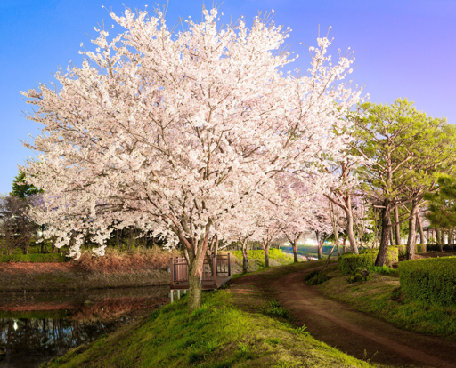

# AnimeGAN: A Novel Lightweight GAN for Photo Animation

Unofficial pytorch-lightning implementation of a paper, ["AnimeGAN: A Novel Lightweight GAN for Photo Animation"](https://www.researchgate.net/publication/341634830_AnimeGAN_A_Novel_Lightweight_GAN_for_Photo_Animation)

- original tensorflow official implementation is here [v1](https://github.com/TachibanaYoshino/AnimeGAN) and [v2](https://github.com/TachibanaYoshino/AnimeGANv2)
- pytorch implementation is [here](https://github.com/ptran1203/pytorch-animeGAN)

## Requirements

need for **training**

- torch==1.10.1
- torchvision==0.11.2
- pytorch-lightning==1.5.7
- tqdm==4.62.3
- wandb==0.12.10
- opencv-python-headless==4.5.5.62
- albumentations==1.1.1
- easydict==1.9

need for **test** and **inference**

- onnxruntime==1.10.0
- moviepy==1.0.3
- pytest==7.0.0
- pytest-watch==4.2.0
- pytest-testmon==1.2.3
- pytest-cov==3.0.0

### Install requirements by pip

```bash
pip install -r requirements.txt
```

### Install requirements by docker

```bash
docker build .
```

## Pretrained weights / models download

### 1. Shinkai style training

- [checkpoint]()
- [torchscript]()
- [onnx]()

## DATASET

- dataset download from original AnimeGAN repo "[download](https://github.com/ptran1203/pytorch-animeGAN/releases/download/v1.0/dataset_v1.zip)"

- download and unzip dataset

```bash
wget -O anime-gan.zip https://github.com/ptran1203/pytorch-animeGAN/releases/download/v1.0/dataset_v1.zip
unzip anime-gan.zip
```

```bash
project root
├── anime-gan.zip
├── dataset
│   ├── Hayao       # --style_image_root
│   │   ├── smooth
│   │   └── style
│   ├── Kimetsu     # --style_image_root
│   │   ├── smooth
│   │   └── style
│   ├── Paprika     # --style_image_root
│   │   ├── smooth
│   │   └── style
│   ├── Shinkai     # --style_image_root
│   │   ├── smooth
│   │   └── style
│   ├── SummerWar
│   ├── test
│   └── train_photo # --real_image_root
├── main.py
...
```

## Training

1. prepare dataset

2. start training

```bash
python main.py \
--seed 2022 \
--real_image_root "./dataset/train_photo" \
--style_image_root "./dataset/Shinkai" \
--device "cuda:0" \
--image_channels 3 \
--image_size 256 \
--batch_size 16 \
--num_workers 8 \
--g_dim 32 \
--d_dim 32 \
--d_layers 3 \
--sn "True" \
--epochs 300 \
--init_epochs 10 \
--init_lr 0.0002 \
--g_lr 0.00002 \
--d_lr 0.00004 \
--beta_1 0.5 \
--beta_2 0.999 \
--ctlw 1.5 \
--stlw 3.0 \
--colw 30.0 \
--advgw 10.0 \
--advdw 10.0 \
--show_image_count 8
```

## Training result

### Shinkai

TODO Video gif

| Input                         | Output                          |
| ----------------------------- | ------------------------------- |
|  |  |
|  |  |
|  |  |
|  |  |
|  |  |
